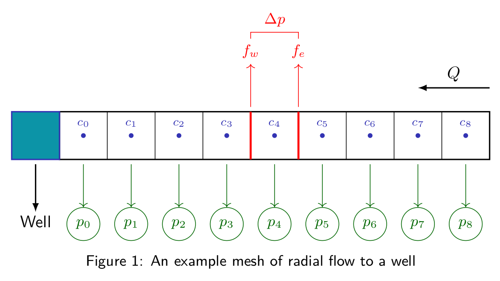

# Assignment for "3-01 Meshing for Reservoir Engineering tasks" unit

## Goals

- Become more comfortable working with `blockMesh`
- Learn about some fundamental meshing practices when it comes
  to near-well flow resolution.

## Basic-level skills

OpenFOAM mesh is designed specifically for **second-order** 
Finite Volume Simulations. In this section, we investigate some
of the pros-n-cons of such mesh design (Mosty focusing on Reservoir
Engineering Applications).

In the lectures, we've mentioned these specific mesh 
characteristics of OpenFOAM mesh generated with `blockMesh`:

- If two blocks are to share a (block) face, they at least
  share one edge.
- Two blocks can only share the whole block edge.

1. If you are to mesh an **L**-shaped domain, how many blocks
   would you need? (More than 2?).

2. Would it be possible to convert traditional Corner-point grids
   to OpenFOAM using `blockMesh`'s hex blocks? (Without any
   aggressive actions on the mesh: no 
   adding/splitting/removing/squashing ... etc of cells):

> Note that, in a corner grid, block vertices are not required to
> be aligned with adjacent block vertices!


(Image from [Petrel Basic Training 2009, slb.com](https://www.ocean.slb.com/PetrelBasicTraining_2009/Content/92.htm))

The full sharing of a face is also a constraint at the cell-level:
You can't have two adjacent cells share only a portion of a face.
And I think It's abvious why: The previous module briefly reviewed 
how matrix coeffcients are caculated for each cell based on its 
faces; Always remember that the emphasis is put on faces instead 
of cells in OpenFOAM calculations.


## Intermediate-level skills

This section will walk you through a popular meshing practice for problems involving
radial flow to (or from) a well. This kind of problems is frequently encountered in
Reservoir Engineering (Usually at a multiphase scale) and Civil Engineering (Ground water,
a single phase case).

In this section, we focus on two main ideas:
- Choosing optimal mesh cells to correctly solve the flow near the well.
- Constructing a Finite-Volume Mesh along the way.

The following figure describes a 1D simplification for the problem to the radial direction
(which we denote as `x`, because radial flow usually happens in a cylindrical setup):



> The reference point of all calculations is at the center of the well cell.

You can think of a well as:
- A **Cell Source**, adding extraction/injection flowrate Q to governing equations. 
- Or a boundary condition for the velocity field acting on the boundary faces of cell 0.

But it's irrelevant for our case because we won't go beyond the meshing step in this assignment.
And of course, we assume a single-phase, steady-state and **incompressible flow** through the domain.

We are particularly interested in the pressure field `p` defined at cell centers `c`.
We also define the pressure difference through a cell to be the difference of pressure values at
its eastern face (fe) and its western one (fw).

> You can learn more about radial flow to wells at 
> [Ground water at clemson.edu](http://www.math.clemson.edu/~warner/Projects/GroundWater/node7.html)

### The Idea

We want to find optimal **cell sizes** that keep cell pressure difference constant throughout the domain.

If the we assume the flow adheres to Darcy's Law:


Where:
- `a` depends on both the porous medium and the fluid; we consider it to be a constant
- `S` is the cross-section area, in a radial setup: 
  
  , where `b` is the domain's depth (ignored) and `x` is the radial direction.

Thus, we'll just write (`a` is some constant):


1. Considering that the flow is incompressible (The volumetric flow rate Q is constant through the domain).
By integrating the previous equation between (fw) and (fe), find the pressure difference over a cell
as a function of positions of (fe) and (fw), Q, and `a`.

2. From that expression, we can choose 
(face positions fall in a geometric sequence) and find `lambda` value by observing that the total pressure
difference through the domain is: ) virtually
because we want all cells to have the same pressure difference (`N` being the number of mesh cells). Derive 
the expression of this lambda value.

> Of course, cell centers then must take midway positions (so they can be centroids) between cell faces;
> this is a requirement by the Finite Volume Method for the approximations to be **second-order accurate**.
> It's particularly attractive to set 
> for convenience instead of working on faces but that would break the second-order accuracy.

> Note also that we haven't fully defined the geometric sequence the face positions follow.

### OpenFOAM Implementation

Now let's use `blockMesh` to translate the calculations we did in the previous section to a valid OpenFOAM mesh.

We'll put all mesh cells in a single mesh block and assume the flow is going **out** of the well
and the well effects perish near a radius Re away (That's the mesh boundary: 
boundary face of cell 8 in the figure)

Using `blockMesh`'s `simpleGrading`, we can grade the mesh using only the ratio between the largest
cell size and the smallest one.

In our case, we must first find the cell size expression. For each cell: 

)

and then we relate everything to the position of the first cell face:

)

`f0` being the position of the boundary face of cell 0 in the figure and `b` is the common retio of the geometric sequence.

1. Applying the same expression on cell `N-1`, you can derive the ratio between the largest cell size and the smallest
one in the block..

Now that we have the grading factor ready, we can go ahead and 
design an appropriate `blockMeshDict`:

2. You can use the case we built in the previous module as a 
   dummy case to generate the mesh on:

   ```bash
   (of@con:run) git clone https://github.com/ResEng-OpenFOAM/res-eng-openfoam-introduction  intro
   (of@con:run) > cd nearWellMesh
   ```

The goal is to mesh a 1D domain of total length of 1 km to 20 cells
where each cell will maintain a pressure difference of 20 psia
(that's around 1.38e5 Pa) in the steady-state flow where
the volumetric flowrate is expected to be `Q = 1e-6 m3/s`.

3. Assuming that `|a| = 0.0896` and that the flow is going out 
   of the well into the porous media, find the corresponding 
   value of `lambda`.

4. Make it so `blockMeshDict` reflects these settings (for the 
   grading factor, use `simpleGrading` in x-direction).

> You may want to increase cell size in secondary directions
> to at least 10 for visualization purposes. Visualizing a
> 1000 meters long domain with a width of 0.1m can be tricky.

5. Run `checkMesh` as usual and pay close attention to the
   reported aspect ratio (should be around 9.7). Do secondary
   directions get involved in the calculation of this metric even
   though the solution is intended to be only in 1D?

## Advanced-level skills

You'll get advanced-level questions only when completing the hole module.
